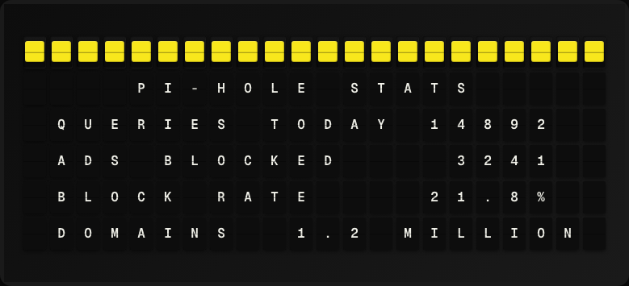

# Pi-hole Stats Plugin

Display DNS query statistics from a local Pi-hole ad blocker.



**→ [Setup Guide](./docs/SETUP.md)**

## Overview

The Pi-hole Stats plugin queries your Pi-hole instance's built-in API to show how many DNS queries have been made today, how many were blocked, and the blocking percentage. Works with Pi-hole v5 and v6. No external API key is required, though Pi-hole v6 uses an app password.

## Template Variables

| Variable | Description | Example |
|---|---|---|
| `pihole.dns_queries_today` | Total DNS queries today | `12435` |
| `pihole.ads_blocked` | Number of ads/queries blocked today | `1823` |
| `pihole.ads_percentage` | Percentage of queries blocked | `14.7` |
| `pihole.status` | Pi-hole status (enabled/disabled) | `enabled` |

## Example Templates

```
PI-HOLE
Status: {{pihole.status}}
Queries: {{pihole.dns_queries_today}}
Blocked: {{pihole.ads_blocked}}
{{pihole.ads_percentage}}% blocked

```

## Configuration

| Setting | Name | Description | Required |
|---|---|---|---|
| `pihole_host` | Pi-hole Host | Hostname or IP address of your Pi-hole (e.g. 192.168.1.100 or pi.hole). | Yes |
| `api_token` | API Token | Pi-hole API token from Settings > API/Web interface. Leave blank if not required. | No |

## Features

- Pi-hole v5 and v6 compatible
- DNS query count and block stats
- Blocking percentage
- Pi-hole enable/disable status
- No external API

## Author

FiestaBoard Team
